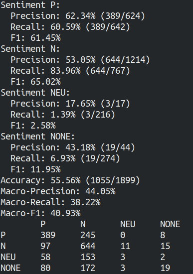

## Práctico Analisis de sentimiento

### Ejercicio 1: Corpus de Tweets: Estadísticas Básicas
Estadisticas por stats.py:
- Cantidad total de tweets.
- Cantidad de tweets por cada valor de polaridad (P, N, NEG y NONE).
    - 'CR': {'N': 311, 'NEU': 94, 'NONE': 165, 'P': 230, 'total': 800}
    - 'ES': {'N': 418, 'NEU': 133, 'NONE': 139, 'P': 318, 'total': 1008}
    - 'PE': {'N': 242, 'NEU': 166, 'NONE': 361, 'P': 231, 'total': 1000}

### Ejercicio 2: Mejoras al Clasificador Básico de Polaridad
Para mejorar el clasificador se agregaron varias modificaciones.
Las mejoras agregadas fueron:
- Binarizacion de conteos
- Normalización Básica de Tweets
- Filtrado de stopwords
- Mejor Tokenizer
- Unir dos vectorizadores con distintos parametros
- Data augmentation

Las primeras 4 mejoras se pasan directamente como parametros a nuestro _Vectorizer_.
Para la 5ta mejora se implementó la clase `Translator` que permite la interaccion con el traductor de google y asi conseguir traducir los tweets originales entre varios idiomas.
Los resultados por la interaccion de los distintos parametros en los _vectorizadores_ se pueden ver en la siguiente notebook:
https://github.com/agusmdev/PLN-2019/blob/practico2/sentiment/grid_search.ipynb

### Ejercicio 3: Exploración de Parámetros ("Grid Search")
Para este ejercicio volvemos a utilizar **Grid Search**, pero evaluando solo los clasificadores.
Para ambos casos tenemos que la mejor configuracion de parametros es la siguiente:

- **C = 0.5**
- **penalty = l2**

La diferente combinacion de parametros se puede ver en las siguientes notebooks:
Logistic Regression: 

https://github.com/agusmdev/PLN-2019/blob/practico2/sentiment/maxent_grid_search.ipynb

SVM:

https://github.com/agusmdev/PLN-2019/blob/practico2/sentiment/svm_grid_search.ipynb

### Ejercicio 4: Inspección de Modelos
El análisis llevado a cabo esta en la siguiente notebook:
https://github.com/agusmdev/PLN-2019/blob/practico2/sentiment/model_inspection.ipynb

### Ejercicio 5: Análisis de Error
El análisis llevado a cabo esta en la siguiente notebook:
https://github.com/agusmdev/PLN-2019/blob/practico2/sentiment/error_analysis.ipynb

### Ejercicio 6: Evaluación Final
Los resultados de realizar la evaluacion sobre el conjunto de test, son los siguientes:

