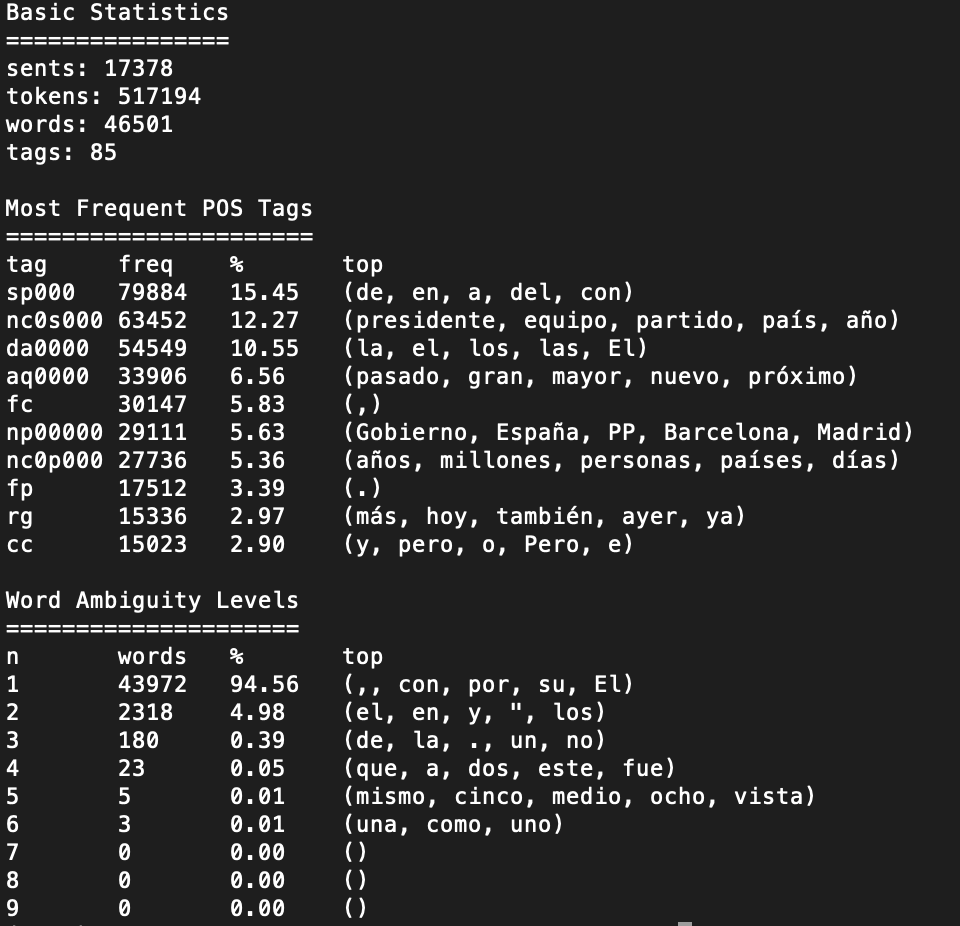

### Ejercicio 1: Corpus AnCora: Estadísticas de etiquetas POS

Los resultados de las estadisticas del corpus ancora son los siguientes:

### Ejercicio 2: Baseline Tagger

Para la implementacion de `BaselineTagger` se cuentan por cada palabra la cantidad de tags asociados.

- Se construye un vocabulario que servirá para verificar si una palabra existe o no.
- Por cada palabra se ordenan los tags asociados de mayor a menor probabilidad y se extrae el primero (el que tiene mayor probabilidad) y se lo guarda en un diccionario que mappea de palabras a tag de mayor probabilidad.
- Para asignar un tag a una palabra simplemente se devuelve el tag más frecuente.

### Ejercicio 3: Entrenamiento y Evaluación de Taggers

Se implementó la clase `Evaluator()` para calcular y mostrar los resultados de la evaluacion de un modelo de tagging:
Los resultados de evaluar el modelo entrenado con `BaselineTagger` son los siguientes:

### Ejercicio 4: Hidden Markov Models y Algoritmo de Viterbi

- Se implemento Hidden Markov Model en la clase `HMM` cuyos parámetros son las probabilidades de transición entre estados (las etiquetas) y de emisión de símbolos (las palabras).
- Se implemento tambien el algoritmo de Viterbi, en la clase `ViterbiTagger` que calcula el etiquetado más probable de una oración.

### Ejercicio 5: HMM POS Tagger
Se implemento un Hidden Markov Model cuyos parámetros se estiman usando Maximum Likelihood sobre un corpus de oraciones etiquetado.
Se utilizo la clase `MLHMM` que hereda de `HMM` utilizando la mayoria de sus metodos.

Resultados de entrenar MLHMM:

- n = 1
    - Tiempo de evaluacion: 23,3s
    - Accuracy: 85.84%
    - Accuracy for known words: 95.28%
    - Accuracy for unknown words: 0.45%
- n = 2
    - Tiempo de evaluacion: 44,4s
    - Accuracy: 91.34%
    - Accuracy for known words: 97.63%
    - Accuracy for unknown words: 34.33%
- n = 3
    - Tiempo de evaluacion: 3m42s
    - Accuracy: 91.86%
    - Accuracy for known words: 97.65%
    - Accuracy for unknown words: 39.49%
- n = 4
    - Tiempo de evaluacion: 26m58s
    - Accuracy: 91.58%
    - Accuracy for known words: 97.29%
    - Accuracy for unknown words: 39.83%

### Ejercicio 6: Clasificador "three words"

Para este ejercicio se implementó un tagger que utiliza un clasificador para etiquetar cada palabra en base a la información disponible en una ventana de largo __n__ alrededor de la palabra.
Se tienen en cuenta los siguientes features:

- la palabra actual en minúsculas.
- si la palabra actual empieza en mayúsculas.
- si la palabra actual está en mayúsculas.
- si la palabra actual es un número.
- mismos features para las n palabras siguientes y anteriores.

Los resultados de evaluar el modelo son los 
siguientes:

- Modelo entrenado con Regresion lineal:
   - Tiempo de evaluacion: 10,3s
   - Accuracy: 91.53%
   - Accuracy for known words: 94.92%
   - Accuracy for unknown words: 60.80%

- Modelo entrenado con SVM:
    - Tiempo de evaluacion: 11,2s
    - Accuracy: 93.39%
    - Accuracy for known words: 97.00%
    - Accuracy for unknown words: 60.74%

- Modelo entrenado con MNB:
    - Tiempo de evaluacion: 7m26s
    - Accuracy: 78.99%
    - Accuracy for known words: 82.21%
    - Accuracy for unknown words: 49.85%

### Ejercicio 7: Clasificador con Word Embeddings fastText

Se implementó un clasificador mixto `FastTextClassifier` utilizando word embeddings fastText y los features utilizados en el clasificador del ejercicio anterior y utilizando el vectorizador provisto en *fasttext.py*.
Se utilizó un modelo pre-entrenado para el idioma castellano.

El modelo entrenado con este clasificador, tardó un tiempo considerablemente mayor a todos los anteriores, ocupando 2hs para el entrenamiento del modelo.

Los resultados de la evaluación del modelo son los siguientes:

- Tiempo de evaluación: 21s
- Accuracy: 96.01%
- Accuracy for known words: 96.98%
- Accuracy for unknown words: 87.18%
