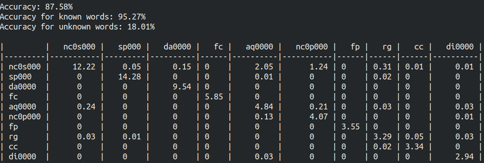

### Ejercicio 3: Entrenamiento y Evaluación de Taggers

Se implementó la clase `Evaluator()` para calcular y mostrar los resultados de la evaluacion de un modelo de tagging:
Los resultados de evaluar el modelo entrenado con `BaselineTagger` son los siguientes:

### Ejercicio 5: HMM POS Tagger

Resultados de entrenar MLHMM:

- n = 1
    - Tiempo de evaluacion: 23,3s
    - Accuracy: 85.84%
    - Accuracy for known words: 95.28%
    - Accuracy for unknown words: 0.45%
- n = 2
    - Tiempo de evaluacion: 44,4s
    - Accuracy: 91.34%
    - Accuracy for known words: 97.63%
    - Accuracy for unknown words: 34.33%
- n = 3
    - Tiempo de evaluacion: 3m42s
    - Accuracy: 91.86%
    - Accuracy for known words: 97.65%
    - Accuracy for unknown words: 39.49%
- n = 4
    - Tiempo de evaluacion: 26m58s
    - Accuracy: 91.58%
    - Accuracy for known words: 97.29%
    - Accuracy for unknown words: 39.83%

### Ejercicio 6: Clasificador "three words"

Para este ejercicio se implementó un tagger que utiliza un clasificador para etiquetar cada palabra en base a la información disponible en una ventana de largo __n__ alrededor de la palabra.
Se tienen en cuenta los siguientes features:

- la palabra actual en minúsculas.
- si la palabra actual empieza en mayúsculas.
- si la palabra actual está en mayúsculas.
- si la palabra actual es un número.
- mismos features para las n palabras siguientes y anteriores.

Los resultados de evaluar el modelo son los 
siguientes:

- Modelo entrenado con Regresion lineal:
   - Tiempo de evaluacion: 10,3s
   - Accuracy: 91.53%
   - Accuracy for known words: 94.92%
   - Accuracy for unknown words: 60.80%

- Modelo entrenado con SVM:
    - Tiempo de evaluacion: 11,2s
    - Accuracy: 93.39%
    - Accuracy for known words: 97.00%
    - Accuracy for unknown words: 60.74%

- Modelo entrenado con MNB:
    - Tiempo de evaluacion: 7m26s
    - Accuracy: 78.99%
    - Accuracy for known words: 82.21%
    - Accuracy for unknown words: 49.85%
